## 一、连接钉钉接口的方法，并调用本公司的数据

### 1、登录和配置

> - [钉钉开发平台登录](https://appcenter.dingtalk.com/)，然后点击右上角的  **登录开发者后台**

1.2、步骤一：登录成功后

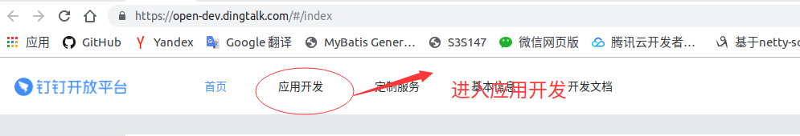

1.3、步骤二：创建应用

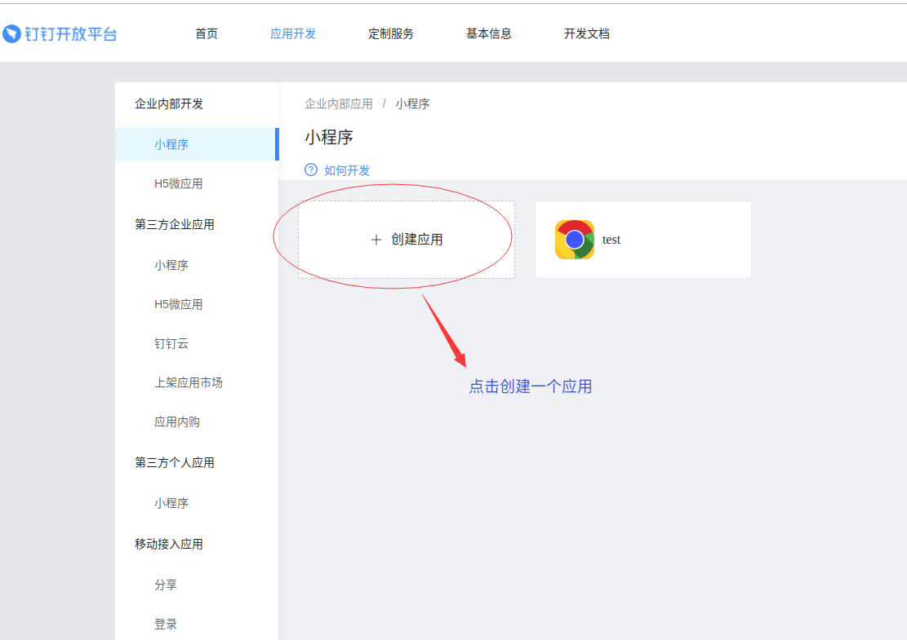

1.4、步骤三：填入信息

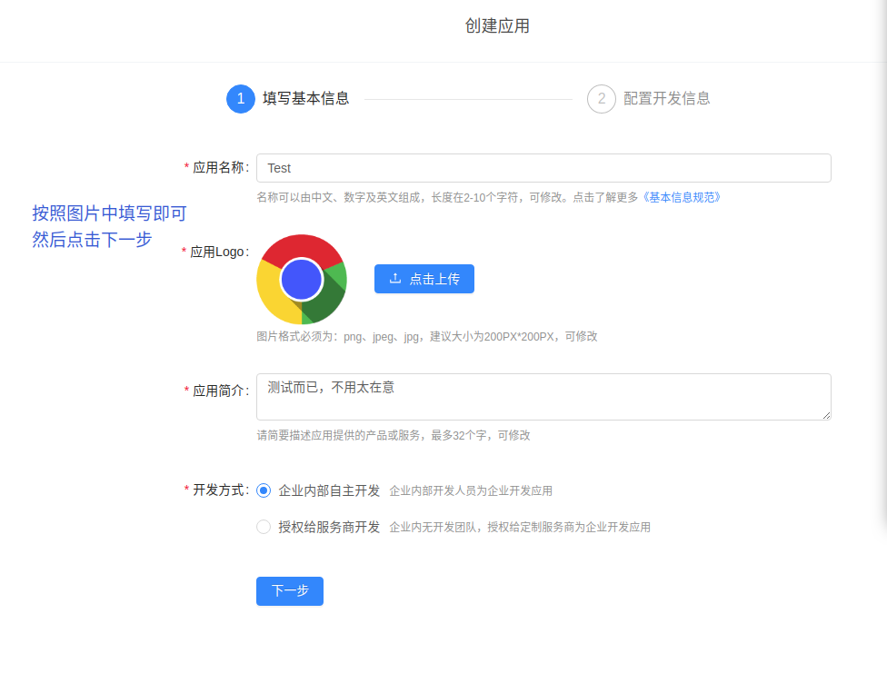

1.5、步骤四： **一定要把 ip 写正确**  关系到能不能访问

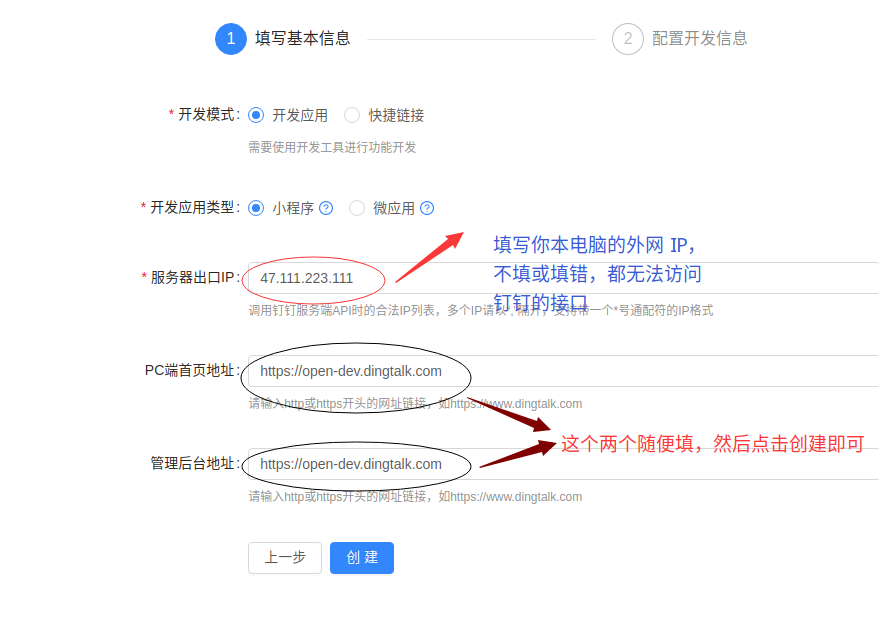

1.6、步骤五：

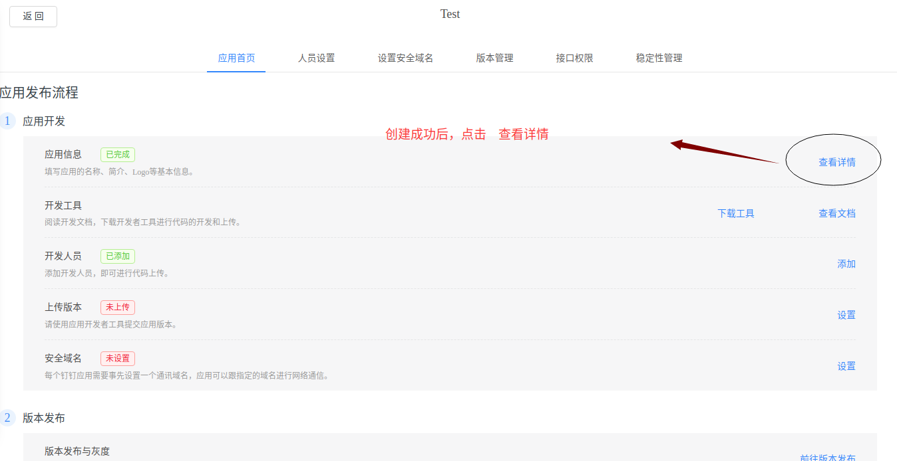

1.7 步骤六： 获取 AppKey 和 AppSecret

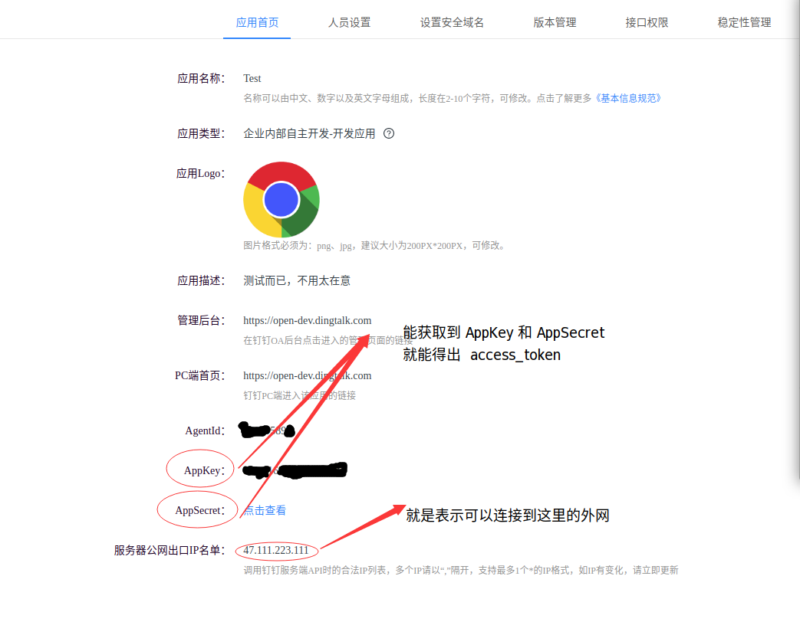

1.8 步骤七：开通权限

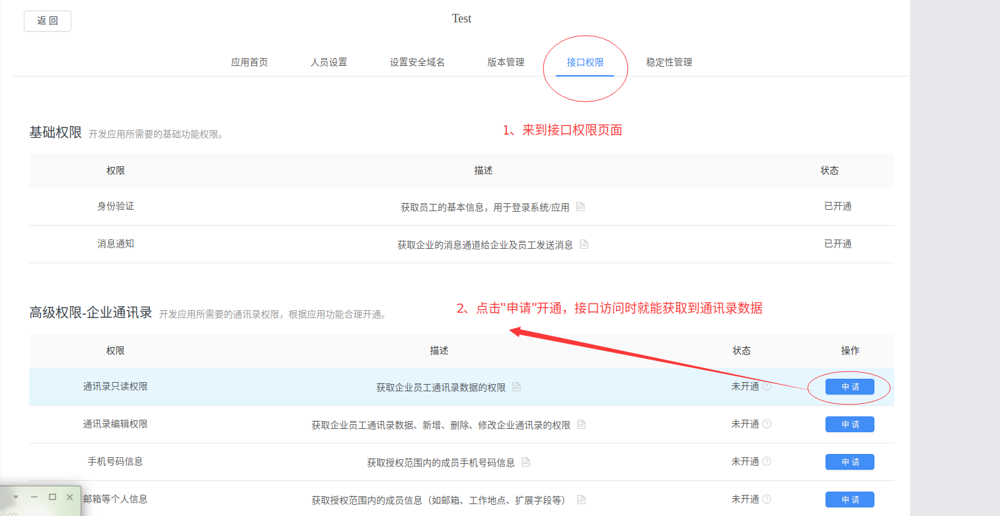

1.9 步骤八：

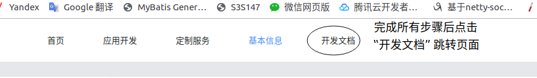

2.0 步骤九：查阅文档

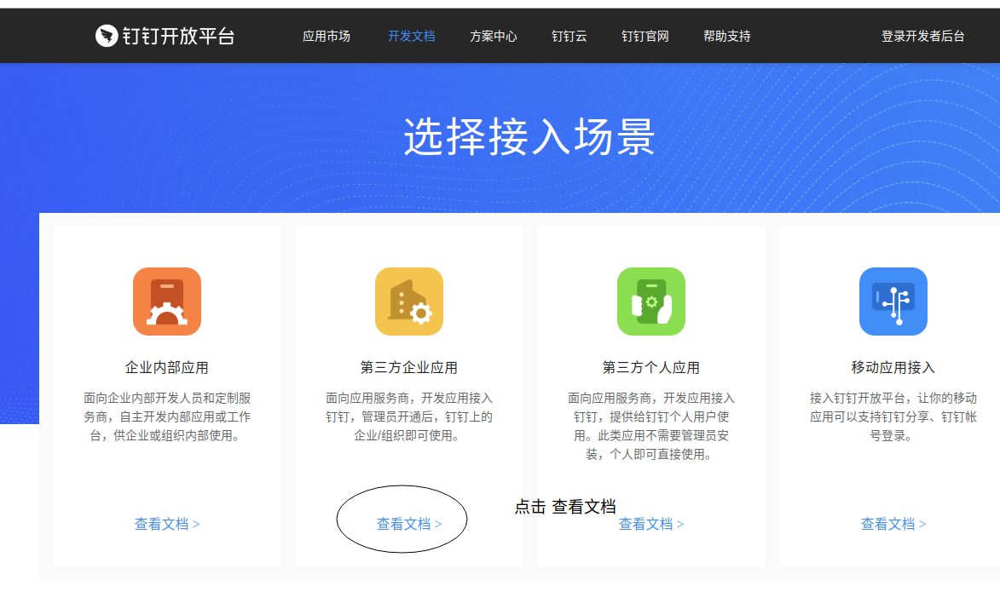

2.1 步骤十：下载 JAVA SDK

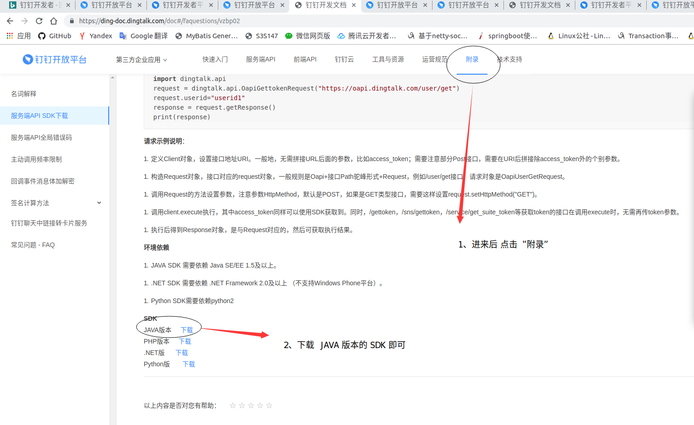

2.2 步骤十一： 我这里是 spring boot 项目

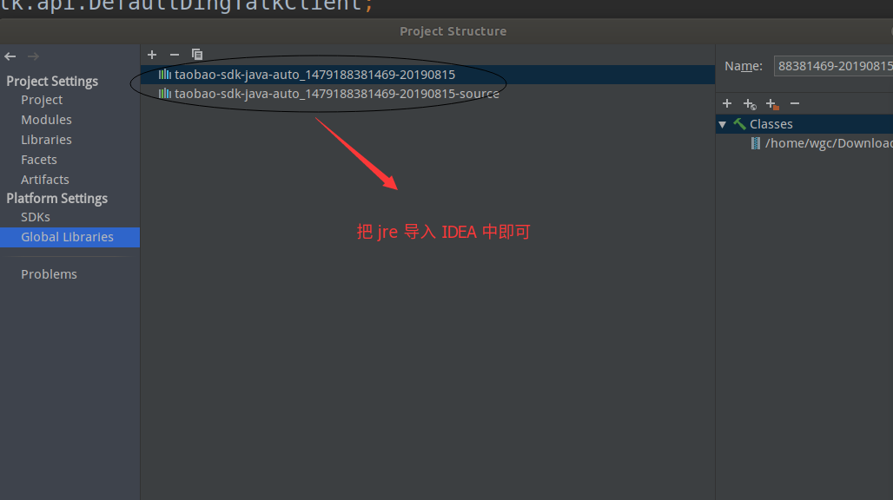

2.3 步骤十二： 结束

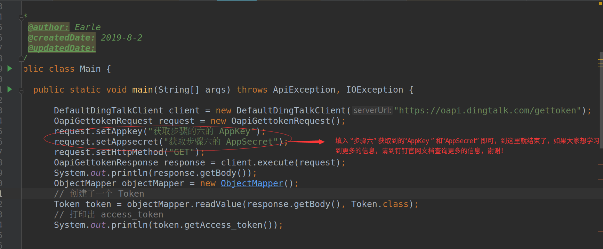

